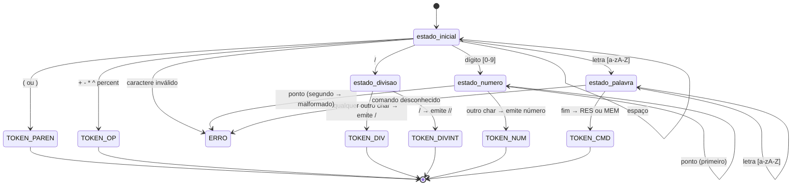

# RA1-17 — Compilador RPN para Assembly ARMv7

## Informações Acadêmicas

| Campo | Detalhe |
|-------|---------|
| **Instituição** | PUCPR — Pontifícia Universidade Católica do Paraná |
| **Disciplina** | Construção de Interpretadores |
| **Professor** | Frank Alcantara |
| **Grupo Canvas** | RA1 17 |

### Integrantes (ordem alfabética)

| Nome | GitHub |
|------|--------|
| Felipe Boaretto | [@BoarettoFelipe](https://github.com/BoarettoFelipe) |
| Igor Mamus | [@igormamus1703](https://github.com/igormamus1703) |

---

## Descrição do Projeto

Este projeto implementa a **Fase 1** de um compilador para uma linguagem de programação baseada em **Notação Polonesa Reversa (RPN)**. O programa, escrito em Python, realiza três etapas:

1. **Análise Léxica** — Um Autômato Finito Determinístico (AFD), implementado com funções, lê um arquivo de texto contendo expressões RPN e extrai tokens válidos.
2. **Validação** — As expressões são avaliadas em Python usando uma pilha, servindo como referência para verificar a corretude do Assembly gerado.
3. **Geração de Assembly** — Os tokens são traduzidos para código Assembly ARMv7 (IEEE 754, 64 bits) funcional no simulador CPUlator com o modelo DE1-SoC.

> **Regra fundamental:** Nenhum cálculo é realizado em Python no fluxo final. O código Python apenas lê, analisa e traduz. Quem executa as operações matemáticas é o processador ARMv7 no CPUlator.

---

## Arquitetura do Compilador

### Fluxo de Dados

```
arquivo.txt → lerArquivo → parseExpressao (AFD) → tokens.txt
                                                       ↓
                                              executarExpressao (validação Python)
                                                       ↓
                                              gerarAssembly → saida.s → CPUlator ARMv7
```

### Diagrama do Autômato Finito Determinístico (AFD)

O analisador léxico é implementado como um AFD onde cada estado é uma função Python. As transições entre estados são determinadas pelo caractere atual da entrada:



#### Estados e suas funções

| Função | Responsabilidade |
|--------|-----------------|
| `estado_inicial(p)` | Ponto de entrada. Classifica o caractere atual e despacha para o estado correto. Ignora espaços. |
| `estado_divisao(p)` | Diferencia `/` (divisão real) de `//` (divisão inteira) olhando o próximo caractere. |
| `estado_numero(p, inicio)` | Consome dígitos e no máximo um ponto decimal. Detecta números malformados como `3.14.5`. |
| `estado_palavra(p, inicio)` | Consome letras e valida se o resultado é `RES` ou `MEM`. Rejeita comandos desconhecidos. |

---

## Funcionalidades Implementadas

### Operações Aritméticas (IEEE 754, 64 bits)

| Operação | Símbolo | Exemplo RPN | Instrução ARM |
|----------|---------|-------------|---------------|
| Adição | `+` | `(5 3 +)` | `VADD.F64` |
| Subtração | `-` | `(10 3 -)` | `VSUB.F64` |
| Multiplicação | `*` | `(3.14 2 *)` | `VMUL.F64` |
| Divisão real | `/` | `(20 4 /)` | `VDIV.F64` |
| Divisão inteira | `//` | `(10 3 //)` | `VDIV.F64` + `VCVT` (truncamento) |
| Resto | `%` | `(15 4 %)` | Sub-rotina VFP: `a - trunc(a/b) * b` |
| Potenciação | `^` | `(2 3 ^)` | Sub-rotina: loop de multiplicação |

### Comandos Especiais

| Comando | Formato | Descrição |
|---------|---------|-----------|
| Armazenar | `(V NOME)` | Guarda o valor V na variável NOME. Ex: `(10 MEM)` |
| Recuperar | `(NOME)` | Retorna o valor armazenado em NOME. Retorna 0.0 se não inicializada. |
| Histórico | `(N RES)` | Retorna o resultado de N linhas anteriores. Ex: `(0 RES)` = última linha. |

### Expressões Aninhadas

A linguagem suporta aninhamento sem limite de profundidade:

```
((5 3 +) (2 4 *) -)         → (5+3) - (2*4) = 8 - 8 = 0
((1.5 2.0 *) (3.0 4.0 *) /) → (1.5*2) / (3*4) = 3/12 = 0.25
```

---

## Estrutura do Repositório

```
RA1-17/
├── main.py           # Código-fonte principal (léxico + execução + geração Assembly)
├── teste1.txt        # Arquivo de teste 1 (10 expressões)
├── teste2.txt        # Arquivo de teste 2 (10 expressões)
├── teste3.txt        # Arquivo de teste 3 (10 expressões)
├── tokens.txt        # Tokens gerados na última execução
├── saida.s           # Assembly ARMv7 gerado na última execução
└── README.md         # Este arquivo
```

---

## Como Executar

### Pré-requisitos

- Python 3.8 ou superior
- Acesso ao [CPUlator](https://cpulator.01xz.net/?sys=arm-de1soc) (simulador online)

### Passo 1 — Gerar os tokens e o Assembly

```bash
python main.py teste1.txt
```

O programa irá:
1. Ler o arquivo `teste1.txt`
2. Executar a análise léxica (AFD) e gerar `tokens.txt`
3. Validar as expressões em Python (apenas para conferência)
4. Gerar o arquivo `saida.s` com o Assembly ARMv7

### Passo 2 — Executar no CPUlator

1. Acesse [cpulator.01xz.net](https://cpulator.01xz.net/?sys=arm-de1soc)
2. Selecione o sistema **ARMv7 DE1-SoC**
3. Cole o conteúdo de `saida.s` no editor
4. Clique em **Compile and Load**, depois **Continue**
5. Após a execução parar no loop `_end`, vá em **Memory (Ctrl-M)**
6. Digite `res_0` no campo "Go to address" para ver os resultados

### Passo 3 — Interpretar os resultados

Os resultados ficam nos labels `res_0` a `res_N` na memória, codificados em IEEE 754 de 64 bits (double). Cada resultado ocupa 8 bytes (2 words de 32 bits em little-endian).

Exemplo: `res_0 = 0x00000000 0x40200000` decodificado em IEEE 754 equivale a **8.0**

---

## Testes

### Funções de Teste do Analisador Léxico

O programa valida automaticamente durante a análise léxica:

**Entradas válidas aceitas:**
- `(3.14 2.0 +)` → tokens: `(`, `3.14`, `2.0`, `+`, `)`
- `(10 MEM)` → tokens: `(`, `10`, `MEM`, `)`
- `(0 RES 5 +)` → tokens: `(`, `0`, `RES`, `5`, `+`, `)`

**Entradas inválidas rejeitadas:**
- `(3.14.5 2.0 +)` → Erro: número malformado `3.14.5`
- `(3.14 2.0 &)` → Erro: caractere inválido `&`
- `(10 CONTADOR)` → Erro: comando desconhecido `CONTADOR`

### Validação Python vs Assembly

A etapa de execução em Python (`executarExpressao`) serve como oráculo de teste. Os resultados Python são comparados com os valores na memória do CPUlator para garantir que o Assembly gerado está correto.

---

## Detalhes Técnicos

### Por que não usamos SDIV?

O processador Cortex-A9 da placa DE1-SoC (ARMv7-A) não suporta a instrução `SDIV` (divisão inteira de registradores). Essa instrução só existe nas variantes ARMv7-R e ARMv7-M. Para contornar isso, implementamos divisão inteira e resto usando apenas instruções VFP:

- **Divisão inteira:** `VDIV.F64` → `VCVT.S32.F64` (trunca) → `VCVT.F64.S32`
- **Resto:** `a - trunc(a/b) * b`, calculado inteiramente com instruções VFP

### Precisão IEEE 754

Todas as operações usam registradores VFP de 64 bits (`d0`-`d15`), garantindo precisão double conforme a norma IEEE 754. Operações como resto (`%`) podem apresentar resíduos na ordem de 10⁻¹⁵ nos bits menos significativos — isso é comportamento esperado do padrão, não um erro.

### Tratamento de Erros no Assembly

O Assembly gerado inclui validação em tempo de execução para o comando `RES`. Se o índice apontar para uma posição inválida no histórico (negativo ou além da linha atual), a execução desvia para `_error` e seta `error_flag = 1` na memória, evitando memory corruption.

---

## Divisão de Tarefas

| Responsável | Funções Implementadas |
|------------|----------------------|
| **Felipe Boaretto** | `lerArquivo`, `parseExpressao` (AFD com estados por funções), criação e administração do repositório GitHub |
| **Igor Mamus** | `executarExpressao`, `gerarAssembly`, `exibirResultados`, `eh_numero`, `eh_variavel`, `aplicar_operacao`, integração do `main`, arquivos de teste, documentação |
